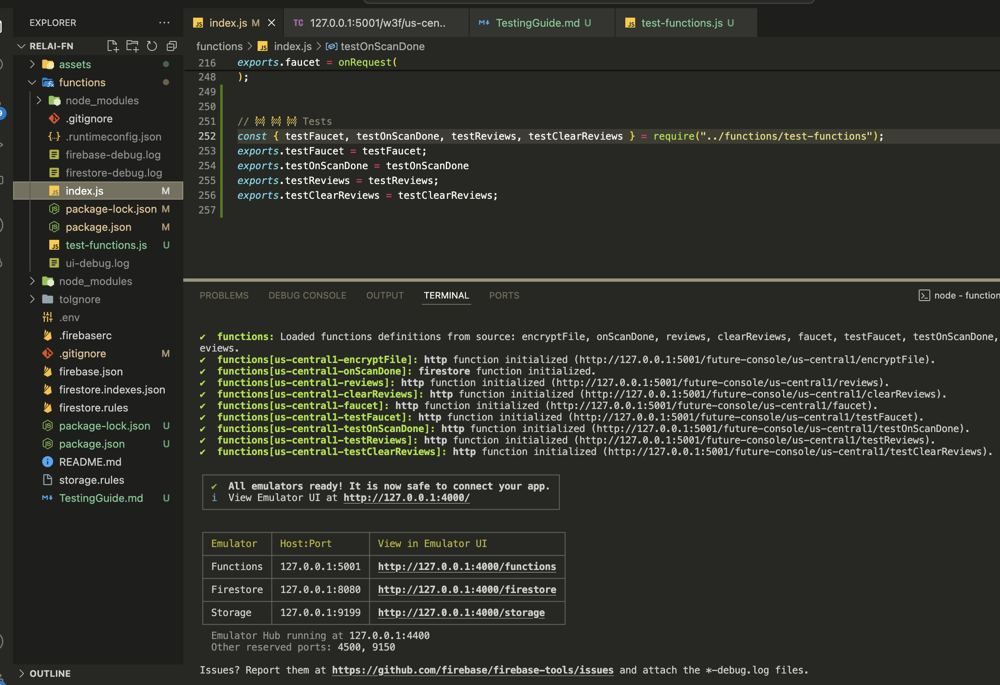

# Relai Network Cloud functions local testing guide

### Install, configure and integrate Local Emulator Suite

First we need to install the emulator suite.

We need to install:
- [Node.js](https://nodejs.org/en/download) version 16.0 or higher

- [Java JDK](https://jdk.java.net/)  version 11 or higher

- [Firebase CLI](https://firebase.google.com/docs/cli)

Now check the installed Firebase Cli version by running
```
firebase --version
```

For more details check this [link](https://firebase.google.com/docs/emulator-suite/install_and_configure)

### Install Firebase tools

Install `firebase-tools` assuming you have already node.js and npm installed.
```
npm install -g firebase-tools
```

A more complete guide can be found [here](https://firebase.google.com/docs/functions/local-emulator) 


### To run the emulators

- cd into `functions` folder and 
- install dependencies by running `npm i`
- run `npm run all` to start the emulator and when the functions are loaded and available you will see the following output or something similar. 

```
✔  functions: Loaded functions definitions from source: encryptFile, onScanDone, reviews, faucet.
✔  functions[us-central1-encryptFile]: http function initialized (http://127.0.0.1:5001/future-console/us-central1/encryptFile).
✔  functions[us-central1-onScanDone]: firestore function initialized.
✔  functions[us-central1-reviews]: http function initialized (http://127.0.0.1:5001/future-console/us-central1/reviews).
✔  functions[us-central1-faucet]: http function initialized (http://127.0.0.1:5001/future-console/us-central1/faucet).

┌─────────────────────────────────────────────────────────────┐
│ ✔  All emulators ready! It is now safe to connect your app. │
│ i  View Emulator UI at http://127.0.0.1:4000/               │
└─────────────────────────────────────────────────────────────┘

┌───────────┬────────────────┬─────────────────────────────────┐
│ Emulator  │ Host:Port      │ View in Emulator UI             │
├───────────┼────────────────┼─────────────────────────────────┤
│ Functions │ 127.0.0.1:5001 │ http://127.0.0.1:4000/functions │
├───────────┼────────────────┼─────────────────────────────────┤
│ Firestore │ 127.0.0.1:8080 │ http://127.0.0.1:4000/firestore │
├───────────┼────────────────┼─────────────────────────────────┤
│ Storage   │ 127.0.0.1:9199 │ http://127.0.0.1:4000/storage   │
└───────────┴────────────────┴─────────────────────────────────┘
  Emulator Hub running at 127.0.0.1:4400
  Other reserved ports: 4500, 9150
```

Open the browser and navigate to this url (http://127.0.0.1:4000) : to see the emulator ui

### Testing

The test of the functions are done against the Firebase emulator.

To tests on the emulator:

uncomment the `// 🚧 🚧 🚧 Tests` section code block at the bottom of `index.js` file to bring into scope the test functions

```javascript
// 🚧 🚧 🚧 Comment/Uncomment when wanting to test (or not) the functions using the Emulator
const { testFaucet, testOnscanDone, testReviews, testClearReviews } = require("../functions/test-functions");
exports.testFaucet = testFaucet;
exports.testOnscanDone = testOnscanDone
exports.testReviews = testReviews;
exports.testClearReviews = testClearReviews;
```

### `testOnscanDone``

The way we are testing the functions is the we created functions that call the functions or that create conditons to trigger functions like `onScanDone` which is a trigger function and is triggered

When an app developer uploads and apk from the Futur store console, the apk is scanned before it can be published to the store.

When the scan is done and successful a document is created in Firestore `apps_scans` collection with the apk metadata.

It is at that time that the `onScanDone` function is called, so it's a trigger function.

To test `onScanDone` we can call the `testOnscanDone` via :

CURL command 
```
 curl http://127.0.0.1:5001/future-console/us-central1/testOnscanDone
```

or 

via tools like `Postman` or `Thunder Client` (a VsCode extension similar to postman)

and

 call via `GET` : `http://127.0.0.1:5001/future-console/us-central1/testOnscanDone`

Before let's run the emulator `npm run all` and we should se something like this:




Now let's open the emulator UI Firestore in the browser: `http://127.0.0.1:4000/firestore/data` and we see the Database is empty.


ok let's open the Thunder Client and send a GET request and see the results


If we go back to the emulator to see the database populated with the data we used in the `test-functions.js` file in `testOnScanDone` 


also in `apps`collection we can see the IPFS `CID` of the file.

**NB: The file is not pinned**


We can see in the storage section that the uploaded apk has been encrypted 


### `testFaucet` to test `faucet` function `index.js`

We have set a hardcoded address (in `test-fucntions.js` at line 53) but you can pass any valid substrate address on [Relai Network](https://polkadot.js.org/apps/?rpc=wss%3A%2F%2Frpc1.relai.network#/accounts)

When you call via `GET` or `CURL` : `http://127.0.0.1:5001/future-console/us-central1/testFaucet`


If you want to test on a  Substrate local node, go to `index.js` file `faucet` function

```javascript
  const wsProvider = new WsProvider('wss://rpc1.relai.network');
```
  by
```javascript
  const wsProvider = new WsProvider('ws://127.0.0.1:9944'); // or ws://127.0.0.1:9945
```

The same method can be used to call other test functions

### `testReviews`: to fetch the queued reviews

### `testClearReviews` to clear the reviews queue for the offchain-worker to fetch
